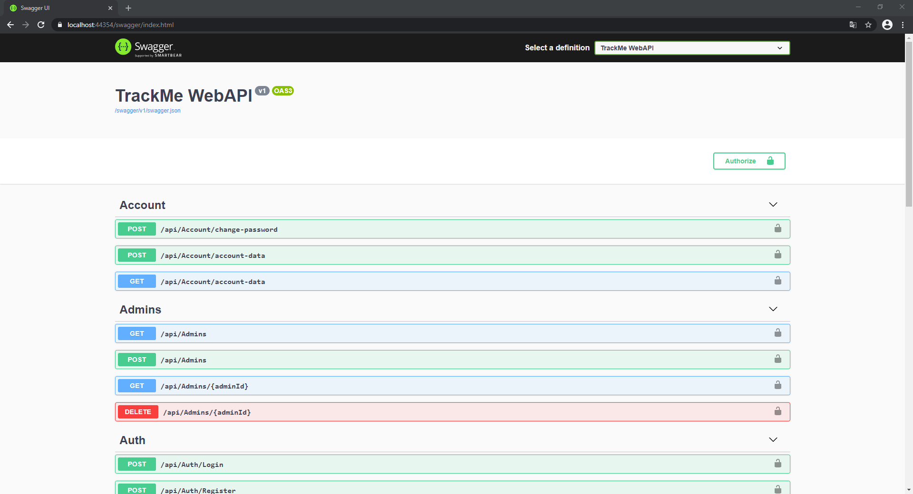
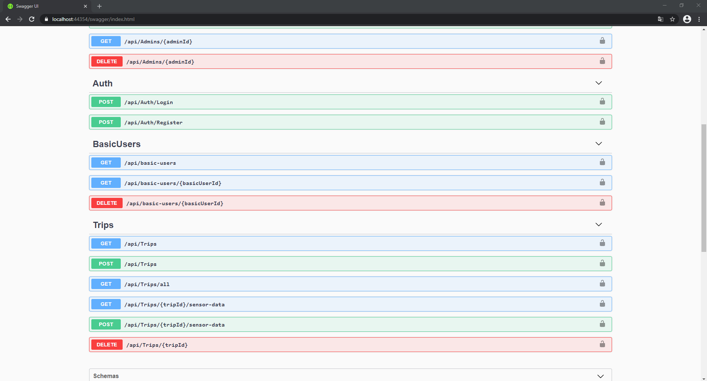
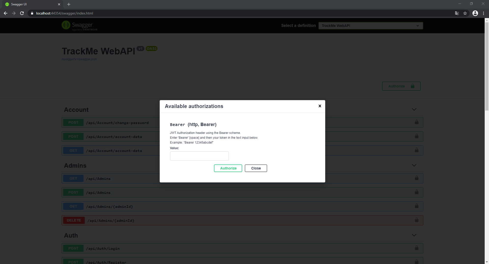

# TrackMe Web API
> A Web API built with ASP.NET Core.

## Table of contents
* [General info](#general-info)
* [Screenshots](#screenshots)
* [Technologies](#technologies)
* [Status](#status)

## General info

Track Me Web API is a web API built with ASP.NET Core. 
Application is the part of my engineering thesis entitled: „Application for acquisition of data from mobile devices' sensors”. 
Project exposes endpoints to upload or fetch data for both mobile and web application. Solution was divided into smaller projects to separate different layers: 

* TrackMe.Domain -> class library containing entity classes of domain
* TrackMe.Database -> class library containing database’s context with data seeder and migrations
* TrackMe.Services -> class library with services (which performs operations on database using database context class) and exceptions throw by these services 
* TrackMe.Models -> class library containing DTOs with mapping profiles
* TrackMe.BusinessServices -> class library with business services which are responsible for mapping data (entities into DTOs and vice versa) and calling methods from services
* TrackMe.Common -> class library with common classes and stuff
* TrackMe.Helpers -> class library with services which are responsible for additional tasks not associated with domain like generating JWT
* TrackMe.WebAPI -> Web API project

Web API endpoints were designed in accordance with the REST architecture. Authentication and authorization is based on JWT. 
Project uses SQL Server to store data in the database. The database is managed by EF Core and was created with Code-First approach. 
Services and business services work together to perform CRUD operations on database. 
Exceptions thrown inside services are handled by custom middleware which sends specific response depending on exception type.

## Screenshots

## Technologies
* ASP.NET Core 3.1
* ASP.NET Core Identity 3.1.9
* Entity Framework Core 3.1.9
* Swagger (Swashbucke.AspNetCore 5.6.3) 

## Status
Project is finished at the moment but in the future it will be migrated to .NET 5.
